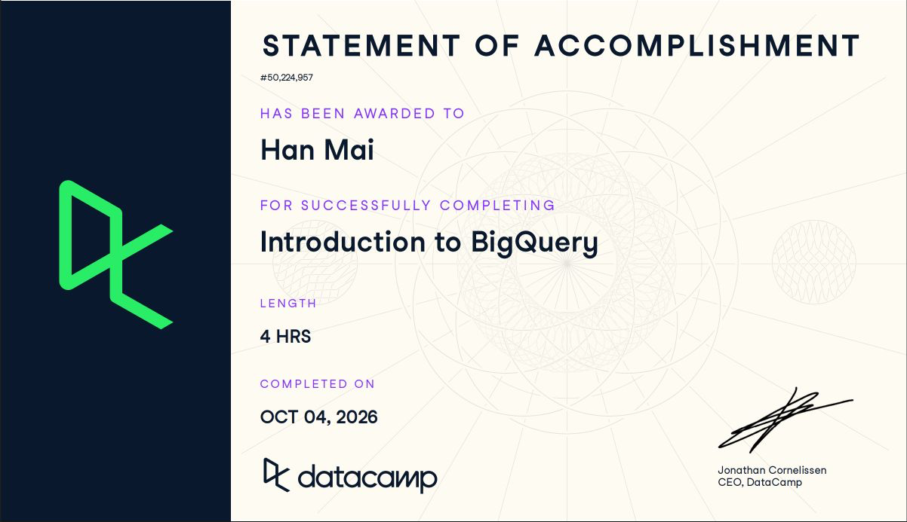

**Student:** Han Mai\
**Course:** IBM 6500 — Customer Insight Methods and Survey Research

## Course-Completion Evidence

I completed DataCamp's Introduction to BigQuery course; the statement of accomplishment records October 4, 2026 as the completion date. These notes follow the four course chapters and the lessons and exercises I reviewed while completing the course.

{width="100%"}

The examples below use DataCamp's modified Olist e-commerce data. They are course examples or short adaptations for reference, not PhD Orthodontics data. The ingestion lessons explained loading procedures conceptually.

## BigQuery Architecture and Structure

### Introduction to BigQuery

**Main ideas.** BigQuery is a serverless analytical data warehouse. The main distinction I practiced was OLAP versus OLTP: BigQuery distributes large analytical queries, while a transactional database is designed for frequent individual transactions. Separating storage from compute lets BigQuery allocate processing resources for a query without requiring me to manage servers. The course compared this with Snowflake's dynamic BI workloads and Redshift's AWS environment.

**BigQuery terminology or procedures.** OLAP means online analytical processing; OLTP means online transactional processing. Serverless means the service manages the processing infrastructure. In the exercise environment, I entered SQL, used Run Code to inspect results, and then submitted the answer. A timed-out session had to be restarted before the first query would run.

**Important SQL syntax.** `SELECT`, `FROM`, and `LIMIT` were the starting pattern. `*` selects every column.

**Example — Starting with e-commerce.**

``` sql
SELECT *
FROM ecommerce.ecomm_order_details
LIMIT 3;
```

**Explanation.** This returns three rows from the order-details table so I can inspect the fields. It does not calculate a business metric. I would use selected columns for a focused analytical query; `LIMIT` limits returned rows and should not be treated as a guarantee of less data scanned.

**CEP / digital marketing application.** A future periodic report could summarize marketing activity across many records. I would use BigQuery for analysis rather than treat it as the system that handles each appointment or lead transaction.

### BigQuery Architecture

**Main ideas.** The architecture lesson helped me connect SQL to the systems behind it. Columnar storage lets a query read the columns it needs. Storage, resource management, and query execution are separate parts of the workflow.

**BigQuery terminology or procedures.** Capacitor is the columnar storage format, and Colossus provides distributed storage, replication, and recovery. Jupiter connects storage and compute; Borg manages computing resources. Dremel organizes query execution into an execution tree with root nodes, mixers, and leaf nodes. Slots represent computing capacity. In the classification exercise, I corrected Capacitor to Storage and Jupiter to Computing.

**Important SQL syntax.** This lesson focused on architecture rather than a new command. The practical SQL habit is selecting the needed columns rather than always using `SELECT *`.

**Example — Ordering the BigQuery architecture.** The conceptual path was Capacitor → Colossus → Jupiter → Dremel: stored columnar data is read through the distributed storage system and network for query execution. The exercise's diagram ran upward, so its visual placement had Dremel at the top and Capacitor at the bottom.

**Explanation.** Remembering the direction of the diagram mattered when placing the cards. Dremel's leaf nodes read and process data, and intermediate results move back through the execution tree. This explains how one SQL query can be processed in parallel.

**CEP / digital marketing application.** This would help me understand why a query that selects a few marketing fields can be more practical than repeatedly retrieving an entire large event table. I do not need to configure these internal systems myself.

### BigQuery data organization

**Main ideas.** Data is organized as project → dataset → table. A dataset groups tables, while a table's schema describes its fields and data types. A project is also part of the access and permission structure.

**BigQuery terminology or procedures.** I should identify the project, dataset, table, and schema before querying. Datasets have locations and permissions. The course emphasized choosing compatible locations when working across datasets, rather than assuming tables in different regions can be joined directly.

**Important SQL syntax.** A full name is `` `project_name.dataset_name.table_name` ``. Here, `project_name` is the Google Cloud project identifier, `dataset_name` is the container for tables, and `table_name` identifies the data table. With the course's default project, `ecommerce.ecomm_sellers` was sufficient.

**Example — Tables in the wild.**

``` sql
SELECT DISTINCT seller_city
FROM ecommerce.ecomm_sellers;
```

**Explanation.** `ecommerce` is the dataset, `ecomm_sellers` is the table, and `seller_city` is the field. `DISTINCT` removes repeated cities. Knowing the structure helps separate a wrong table reference from a problem with the SQL itself.

**CEP / digital marketing application.** If authorized marketing or survey data becomes available, I would first confirm its project, dataset, location, schema, and access. A plausible table name alone would not establish that I have access to actual client data.

## Writing queries and data types

### Writing queries in BigQuery

**Main ideas.** BigQuery uses GoogleSQL. The familiar SQL clauses still apply, but I also need to recognize BigQuery functions and types such as `INT64` and `FLOAT64`. The course used modified Olist tables for products, orders, order details, and payments. Orders contained nested `order_items`; order details held statuses and timestamps; payments held payment methods, installments, and values.

**BigQuery terminology or procedures.** Queries can run through BigQuery Studio, client libraries, command-line tools, or other integrations. My hands-on practice was in DataCamp's editor and result pane. I checked columns, wrote a query, ran it, inspected the result, and corrected it before submitting. `USING (order_id)` joins tables sharing that column name; `ON` states an explicit matching condition.

**Important SQL syntax.** `GROUP BY` defines groups; `SUM()` totals values; `ORDER BY` sorts the result. The default sort is ascending, while `DESC` reverses it.

**Example — Finding order total value.**

``` sql
SELECT
  order_id,
  SUM(payment_value) AS total_payment
FROM ecommerce.ecomm_payments
GROUP BY order_id
ORDER BY total_payment
LIMIT 10;
```

**Explanation.** Each result row represents an order, with its payments added together. Ascending order gives the ten smallest totals. The alias makes this reference example easier to read; a DataCamp exercise may require an unaliased expression to match its expected output.

**CEP / digital marketing application.** Grouping records by a valid identifier could support a future campaign or lead summary. I would define what one row means before summing or counting so multiple records for one lead do not inflate the results.

### Data ingestion in BigQuery

**Main ideas.** The course introduced three batch-loading routes: BigQuery Studio, the `bq` command-line tool, and SQL `LOAD DATA`. This was conceptual practice about how data reaches a queryable table, not a live client-data upload.

**BigQuery terminology or procedures.** The Studio workflow is to select a local file or Cloud Storage source, choose the format, specify the destination project/dataset/table, and define or auto-detect the schema. The formats reviewed were Avro, CSV, JSON, ORC, and Parquet. A schema specifies field names and types. The `bq` route can use format and auto-detection flags; the SQL route reads files from Google Cloud Storage.

**Important SQL syntax.** `LOAD DATA INTO ... FROM FILES (...)` specifies the destination and input options. CSV files can use `skip_leading_rows` for a header row.

**Example — Structuring a LOAD DATA statement.** This is a placeholder version of the pattern reviewed in the lesson, not a command I executed against CEP data.

``` sql
LOAD DATA INTO `project_name.dataset_name.table_name`
FROM FILES (
  format = 'CSV',
  uris = ['gs://example-bucket/orders.csv'],
  skip_leading_rows = 1
);
```

**Explanation.** The destination placeholders mean project, dataset, and table. `example-bucket` and `orders.csv` stand for a Cloud Storage bucket and file. The first CSV row is skipped. This route does not point directly to a file on my computer. After loading, I would check the schema and inspect sample rows before analyzing them.

**CEP / digital marketing application.** A future authorized advertising or survey export could be loaded into a dedicated table. I would verify dates, identifiers, and numeric types before combining it with other sources; auto-detection would still need checking.

### Date/time types in BigQuery

**Main ideas.** A `DATE` is a calendar day; a `TIMESTAMP` identifies an absolute point in time. `DATETIME` has a date and clock time without a time zone, and `TIME` has only a clock time. I practiced extracting date parts, formatting output, and constructing ranges around November 24, 2017.

**BigQuery terminology or procedures.** I should check a field's type before choosing a function. `EXTRACT` retrieves a date part. `DATE_ADD`, `DATE_SUB`, `TIMESTAMP_ADD`, and `TIMESTAMP_SUB` change a value by an interval. `DATE_DIFF` and `TIMESTAMP_DIFF` calculate differences. `CURRENT_DATE()` and `CURRENT_TIMESTAMP()` provide a current reference point.

**Important SQL syntax.** `EXTRACT(part FROM value)`, `INTERVAL n DAY`, and `FORMAT_TIMESTAMP(format, timestamp)` were recurring patterns. `%D` formats a timestamp's date as `MM/DD/YY`.

**Example — Finding data within certain ranges.**

``` sql
SELECT COUNT(order_id) AS orders_in_range
FROM ecommerce.ecomm_order_details
WHERE order_purchase_timestamp BETWEEN
  TIMESTAMP_SUB(TIMESTAMP('2017-11-24'), INTERVAL 3 DAY)
  AND TIMESTAMP_ADD(TIMESTAMP('2017-11-24'), INTERVAL 3 DAY);
```

**Explanation.** This counts orders between the two timestamp boundaries, including both endpoints. It spans three days before and after the reference timestamp, not automatically every hour of the final calendar day. Another exercise extracted quarter 4 and year 2017 together; selecting a quarter alone would combine multiple years. I also practiced `DATE_DIFF(order_date, CURRENT_DATE(), DAY)`, where historical dates produce negative differences because argument order matters.

**CEP / digital marketing application.** These patterns could define campaign periods or summarize activity by month. For a future GA4 or lead report, I would confirm the reporting time zone before converting timestamps into dates.

### Unstructured data

**Main ideas.** The lesson called this “Unstructured data” and focused on arrays and structs. An `ARRAY` holds an ordered list of values, while a `STRUCT` holds named fields and can contain nested data. The Olist orders example used an array of structs for the items within one order.

**BigQuery terminology or procedures.** `UNNEST` turns array elements into rows. An alias lets me access a struct field with dot notation, such as `item.price`. `ARRAY_LENGTH` counts elements, `ARRAY_CONCAT` combines arrays, and `SEARCH` checks for search terms in supported data. Unnesting changes the unit of analysis from an order to its items.

**Important SQL syntax.** `ARRAY(SELECT ...)` constructs an array from query results. `UNNEST(array_column)` expands it. For future reference, `array_column[OFFSET(0)]` explicitly selects the first element with zero-based indexing.

**Example — UNNEST-ing Data.**

``` sql
SELECT
  o.order_id,
  item.product_id,
  item.price
FROM ecommerce.ecomm_orders o
CROSS JOIN UNNEST(o.order_items) AS item;
```

**Explanation.** Each item becomes a row carrying its parent `order_id`. An order with three items can appear three times, so `COUNT(*)` here counts items rather than unique orders. In a separate exercise, I constructed an array of `product_id` values where `product_weight_g = 2220`.

**CEP / digital marketing application.** The same flattening idea could help with repeated fields in future GA4 exports. I would inspect the actual export schema and check for duplicated event rows before using the resulting counts as marketing metrics.

## Querying data in BigQuery

### Common table expressions

**Main ideas.** A CTE is a named result within one query. It made the longer exercises easier to follow by separating filtering, aggregation, and joining into steps. It is not a saved table available to later queries.

**BigQuery terminology or procedures.** Start with `WITH`, give the CTE a name, place its query inside parentheses, and then reference it in the main query. Multiple CTEs use one `WITH` and commas between definitions. A later CTE can reference an earlier one. Filtering early can reduce the rows passed into later operations; writing a CTE alone does not guarantee that its results are stored or that the query runs faster.

**Important SQL syntax.** `WITH name AS (...) SELECT ... FROM name` gives the definition and its use in one statement.

**Example — Filtering data with CTEs.**

``` sql
WITH orders AS (
  SELECT order_id
  FROM ecommerce.ecomm_orders,
    UNNEST(order_items) AS items
  WHERE items.price > 150
)
SELECT
  COUNT(order_id) AS matching_item_rows,
  order_status
FROM ecommerce.ecomm_order_details od
JOIN orders o USING (order_id)
GROUP BY order_status;
```

**Explanation.** This filters expensive items before joining to order details and counting by status. Because an order can have several qualifying items, the exercise pattern counts matching item rows. If the question instead asks for unique orders, I would use `COUNT(DISTINCT order_id)` or deduplicate the CTE. In a later join exercise, removing the starter CTEs caused an error; the final query depended on keeping their definitions.

**CEP / digital marketing application.** CTEs could separate a future campaign-date filter from lead aggregation and source joins. Naming each step would help me inspect how the result was produced and catch duplicate records.

### Aggregations

**Main ideas.** Aggregations turn detailed records into summaries. I reviewed `COUNT`, `SUM`, `AVG`, `MIN`, and `MAX`, then practiced `COUNTIF`, `HAVING`, and `ANY_VALUE`. The grouping field determines what each output row represents.

**BigQuery terminology or procedures.** `WHERE` filters input rows, `GROUP BY` creates groups, and `HAVING` filters the resulting groups. `COUNT(column)` counts non-null values, whereas `COUNT(*)` counts rows. `ANY_VALUE` selects an arbitrary value from a group; it should not be interpreted as the first or most common value. `ANY_VALUE(value HAVING MAX metric)` ties the selection to a maximum metric, with possible ambiguity if values tie.

**Important SQL syntax.** `COUNTIF(condition)` counts rows where a condition is true. `HAVING AVG(...) > threshold` filters groups using an aggregate.

**Example — Using COUNTIF.**

``` sql
SELECT
  product_category_name_english,
  COUNTIF(product_weight_g > 5000) AS heavy_products
FROM ecommerce.ecomm_products
GROUP BY product_category_name_english;
```

**Explanation.** Each row is a product category, with a count of products weighing more than 5,000 grams. It counts products in the product table, not purchases or customers. Sorting or a `HAVING` condition could narrow a later report to the categories of interest.

**CEP / digital marketing application.** With a verified lead-status field, `COUNTIF` could count qualified leads by source. I would keep missing values and the definition of “qualified” visible rather than assume every inquiry became a patient.

### Special aggregations in BigQuery

**Main ideas.** BigQuery also supports summaries that return strings, arrays, estimates, or Boolean results. I practiced combining category names and estimating distributions. Approximate functions trade exactness for useful performance on large datasets, so their outputs need to be labeled as estimates.

**BigQuery terminology or procedures.** `STRING_AGG` combines strings, optionally with a delimiter and `DISTINCT`. `ARRAY_CONCAT_AGG` combines arrays across rows. `APPROX_COUNT_DISTINCT` estimates unique values; `APPROX_QUANTILES` returns approximate boundaries; `APPROX_TOP_COUNT` estimates frequent values; `APPROX_TOP_SUM` estimates top values by a numeric weight. `LOGICAL_AND` checks whether all non-null conditions are true, while `LOGICAL_OR` checks whether any is true. These logical functions are not approximate counts.

**Important SQL syntax.** `STRING_AGG(DISTINCT expression, ', ')` combines distinct strings. `APPROX_QUANTILES(value, 4)` returns five boundaries defining four intervals.

**Example — Using STRING_AGG and ARRAY_CONCAT_AGG.** This is the string portion of the exercise.

``` sql
SELECT
  o.order_id,
  STRING_AGG(DISTINCT p.product_category_name_english, ', ') AS categories
FROM ecommerce.ecomm_orders o,
  UNNEST(o.order_items) AS items
JOIN ecommerce.ecomm_products p
  ON items.product_id = p.product_id
WHERE ARRAY_LENGTH(o.order_items) > 1
GROUP BY o.order_id;
```

**Explanation.** The query describes the distinct product categories in each multi-item order. The join connects each nested item to its product category; `DISTINCT` prevents repeated category names. Another exercise used `APPROX_QUANTILES(items.price, 4)` by customer after filtering orders with more than eight items.

**CEP / digital marketing application.** These patterns could summarize response categories or explore a large event dataset. Exact counts would remain preferable for a small final CEP results table; an approximate unique count would be labeled accordingly.

### WINDOW Functions

**Main ideas.** Window functions calculate across related rows while retaining individual rows. This differs from a grouped query, which collapses rows into one result per group. I practiced ranking customer totals, looking at neighboring prices with `LAG` and `LEAD`, changing rolling frames, and filtering with `QUALIFY`.

**BigQuery terminology or procedures.** `OVER` defines a window. `PARTITION BY` separates groups, and window `ORDER BY` defines their sequence. `RANK()` gives tied values the same rank, leaving gaps afterward; `PERCENT_RANK()` expresses relative rank. `ROWS` sets bounds by row positions. `QUALIFY` filters after a window calculation; `HAVING` is for grouped aggregates.

**Important SQL syntax.** `AVG(value) OVER (ORDER BY ... ROWS BETWEEN ... AND ...)` calculates a rolling average. `LAG(value)` looks backward and `LEAD(value)` looks forward in the specified order.

**Example — Filtering with QUALIFY.**

``` sql
SELECT
  order_id,
  order_purchase_timestamp,
  AVG(item.price) OVER (
    ORDER BY order_purchase_timestamp
    ROWS BETWEEN 9 PRECEDING AND CURRENT ROW
  ) AS rolling_avg
FROM ecommerce.ecomm_order_details od
JOIN ecommerce.ecomm_orders o USING (order_id),
  UNNEST(o.order_items) AS item
QUALIFY rolling_avg > 500
ORDER BY order_purchase_timestamp;
```

**Explanation.** This averages the current item row and up to nine preceding item rows, then keeps rows with a rolling average above 500. It is a ten-row window, not ten calendar days or necessarily ten orders. I also changed the frame to current row plus nine following rows and to five preceding plus five following rows. For a reproducible future analysis, I would add suitable tie-breakers when timestamps are equal.

**CEP / digital marketing application.** Window functions could compare current activity with a previous period or rank source summaries. A daily trend would first need one row per day; copying this item-level window would not automatically produce a daily marketing average.

## Data management and optimization

### Joins in BigQuery

**Main ideas.** The join type determines which unmatched rows remain. An inner join keeps matches, a left join keeps all left-side rows, a right join keeps all right-side rows, and a full outer join keeps both sides. A cross join pairs rows without a key-matching condition and is also used with `UNNEST`.

**BigQuery terminology or procedures.** Identify each table's row level, shared key, and matching direction before joining. `JOIN` alone means inner join. `USING` works when the key name is shared; `ON` can compare explicitly named fields. In RIGHT, LEFT, and OUTER joins, I needed to keep both starter CTE definitions so the main query could reference them.

**Important SQL syntax.** `RIGHT JOIN ... USING (product_id)` keeps every right-side product. After an outer join, `COUNT(o.order_id)` counts matched orders rather than counting an unmatched placeholder row.

**Example — Joins with aggregations.**

``` sql
WITH orders AS (
  SELECT o.order_id, item.product_id
  FROM ecommerce.ecomm_orders o,
    UNNEST(o.order_items) AS item
)
SELECT
  p.product_id,
  COUNT(o.order_id) AS matching_item_rows
FROM orders o
RIGHT JOIN ecommerce.ecomm_products p USING (product_id)
GROUP BY p.product_id;
```

**Explanation.** Every product remains, including products with no matching item rows; those products receive a count of zero. A product may occur in several items from the same order, so this exercise pattern counts matched rows, not necessarily distinct orders. Changing the question to unique orders requires `COUNT(DISTINCT o.order_id)`.

**CEP / digital marketing application.** A left join could keep every campaign even when no lead matched. Before combining advertising and lead records, I would verify the linkage and avoid treating a shared date alone as proof of attribution.

### Data manipulation language (DML) statements

**Main ideas.** Reading data and changing stored data are different tasks. `INSERT` adds rows, `UPDATE` changes values, `DELETE` removes rows, and `MERGE` uses source/target matching rules to combine operations. The lesson also introduced `CREATE TABLE AS SELECT` for saving query results as a new table.

**BigQuery terminology or procedures.** A `MERGE` has a target, a source, a matching condition, and actions for matched or unmatched records. BigQuery `UPDATE` uses a `WHERE` condition. The exercises emphasized grouping changes rather than running separate operations on individual rows, with partitioning and clustering discussed as performance considerations. I did not run these statements on client data.

**Important SQL syntax.** `UPDATE table SET column = value WHERE condition` limits an update. `MERGE target USING source ON ... WHEN MATCHED ... WHEN NOT MATCHED ...` defines conditional changes.

**Example — Lesson-style update pattern.** This fictional example follows the lesson's customer-update procedure.

``` sql
UPDATE `project_name.dataset_name.customers`
SET email = 'example@example.com'
WHERE customer_id = 3;
```

**Explanation.** The placeholders identify a project, dataset, and customers table. This example assumes an integer `customer_id` and changes the email for matching ID 3. The address is fictional. I would first inspect the same condition with a `SELECT` to check which rows it matches; this is not an instruction to modify the Olist or CEP tables.

**CEP / digital marketing application.** If an authorized working table needed corrections, these patterns could support a controlled update or merge of a new export. I would keep the raw evidence available and confirm identifiers before changing records.

### Query optimization strategies

**Main ideas.** The course's three checks were to reduce data processed, optimize operations, and reduce output. I practiced selecting necessary columns, filtering before later operations, and using approximate distinct counts. A query can be syntactically correct but still return the wrong metric or process unnecessary data.

**BigQuery terminology or procedures.** Filter early where useful, reduce data before joins, and put final presentation sorting in the outermost query when practical. The lesson favored integer join keys when the schema supports them and Boolean, numeric, or date filters over unnecessary string comparisons. `EXISTS` answers whether a match exists without requiring a complete count. Partition-date filters and approximate aggregates were also discussed; I did not configure production partitions or benchmark execution times.

**Important SQL syntax.** `APPROX_COUNT_DISTINCT` estimates unique values. `TIMESTAMP_SUB(CURRENT_TIMESTAMP(), INTERVAL 90 DAY)` makes a moving cutoff. The saved exercise used `<=` that cutoff, which means older records; for records in the last 90 days, the comparison needs to point the other way. `SAFE_DIVIDE` was a correction we discussed when a denominator could be zero.

**Example — Perform optimizations in BigQuery.**

``` sql
SELECT
  p.payment_installments,
  APPROX_COUNT_DISTINCT(p.order_id),
  AVG(p.payment_value) / AVG(p.payment_installments) AS avg_installment_value
FROM ecommerce.ecomm_payments p
JOIN ecommerce.ecomm_order_details o USING (order_id)
WHERE p.payment_installments > 0
GROUP BY p.payment_installments;
```

**Explanation.** This groups payments by installment count, estimates distinct orders, and calculates average payment value per installment. Within each group, the installment count is constant. The positive-installment filter avoids division by zero. Earlier versions omitted the division or reached a zero denominator. The exercise also rejected an alias on the approximate count because it expected BigQuery's default output name `f0_`; that was an exercise-output requirement, not a rule against descriptive aliases.

**CEP / digital marketing application.** For a future event or lead analysis, I would start with the date range and fields needed for the question, check join duplication, and then decide whether an estimate is appropriate. I would keep exact evidence-based results separate from exploratory approximations.

## Overall Reflection and Future Reference

**Most useful concepts and procedures.** I found the project–dataset–table structure useful because it helped me understand where the data I query comes from. CTEs and `UNNEST` were also useful: CTEs broke longer queries into readable steps, while `UNNEST` showed why one order could become several item rows. That row-level distinction is something I would check before trusting any count.

**BigQuery compared with SQL syntax alone.** Learning SQL gave me the clauses to request data. BigQuery added the surrounding workflow: finding the right table, checking the schema and location, understanding loading options, working with nested fields, and considering what the query processes. I practiced queries in DataCamp and reviewed BigQuery Studio and ingestion procedures conceptually; I have not set up a client-data pipeline.

**Most challenging material.** Window frames and nested arrays took the most attention. I had to distinguish a window over item rows from a time period and check which records a join kept. The corrections were useful reminders: a CTE has to remain in the same query, an approximate-count alias can conflict with an exercise's expected output, and dividing by installment counts requires handling zero. I would read the error and check the complete starter query before replacing it.

**Future marketing, customer, survey, GA4, and CEP uses.** If authorized data is available, I could use date filters and aggregations for campaign-period summaries, joins for reliably linked customer or lead records, and `COUNTIF` for response or lead-status summaries. Survey exports could be organized by a consistent respondent identifier and question schema. Repeated GA4 fields could require `UNNEST` before analysis. For the PhD Orthodontics CEP, these are possible future workflows; the course exercises do not establish that I currently have client BigQuery data or a valid inquiry-to-patient attribution chain.

**What I expect to review again.** My reference sequence is: identify the project/dataset/table and permissions; inspect the schema and row level; select the fields and date range; flatten only the arrays needed; filter or summarize in CTEs; choose a join that keeps the intended records; and check the output before interpreting it. I expect to revisit `EXTRACT`, timestamp intervals, `UNNEST`, `COUNTIF`, `HAVING`, `RANK`, `LAG`/`LEAD`, row frames, `QUALIFY`, and exact versus approximate counts. The closing lesson mentioned BigQuery Machine Learning as a possible next topic, not a skill I practiced in this course.

## Appendix: Publication Links

-   [GitHub Repository](https://github.com/hanamai111/ibm-6500-sql-learning-portfolio)
-   [Published Introduction to BigQuery Report](https://hanamai111.github.io/ibm-6500-sql-learning-portfolio/introduction-to-bigquery.html)

*Publication status: the direct report URL is reserved for this page and will be verified after local review and approval to publish.*
