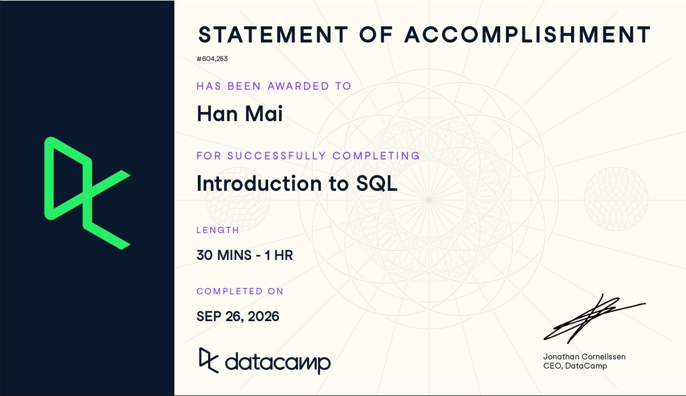

**Course:** IBM 6500 — Customer Insight Methods and Survey Research  
**Program:** Master of Science in Digital Marketing (MSDM)  
**Submission date:** September 26, 2026

## Course-Completion Evidence

I completed DataCamp's **Introduction to SQL** on **September 26, 2026**, as recorded on the Statement of Accomplishment awarded to **Han Mai**. The certificate below documents the course title, recipient, and completion date.

{width=100%}

[View the original DataCamp statement](https://www.datacamp.com/statement-of-accomplishment/course/52cce971db1c4baeda89944d97ee9e4301370b0e?raw=1).

## Learning Notes and Key Takeaways

These notes follow the three lessons in my completed DataCamp course. The examples use its fictional digital marketing company and the actual `campaigns`, `conversions`, and `leads` tables. Any connection to my PhD Orthodontics CEP or Google Ads Analytics Objective is a proposed application, not an analysis of actual practice or patient data. The SQL blocks are reference examples; they do not run against a live database when this report renders.

## Meet Databases & SQL

### Main Ideas

SQL stands for **Structured Query Language**. A query is the instruction I send to a database; its result is the information returned. At the beginning of the lesson, I described SQL as commands for accessing, organizing, and analyzing database data. The lesson made that description more concrete by separating the language, the stored data, and the resulting output.

A database manages data so that it can be stored reliably, retrieved, and used systematically. Databases support both applications and analysis. For example, an application can display active campaigns, while an analyst uses the stored campaign and conversion records to prepare a report.

A relational database organizes information into **tables**. The lesson introduced separate tables for campaigns, leads, conversions, and channels, with each table representing a different subject. A **row** is one record or observation, such as one campaign or one lead. A **column** is a field or attribute describing those records, such as a campaign's name or a lead's country.

| Lesson table | What one row represents | Fields shown in the lesson |
|---|---|---|
| `campaigns` | One campaign | `campaign_id`, `campaign_name`, `channel`, `budget`, `platform`, `performance_score`, `impressions` |
| `leads` | One lead | `lead_id`, `first_name`, `last_name`, `email`, `country`, `signup_date` |

In the displayed campaigns table, the Spring Sale Email Blast was one row: campaign ID 1, Email channel, budget 2500.00, Mailchimp platform, performance score 87.5, and 145000 impressions. Those are DataCamp example values. The `campaign_name` column contained the campaign names across the different rows.

Spreadsheets and database tables can look similar, but their uses differ. Spreadsheets are convenient for small tasks and direct editing. Databases are designed for larger datasets, shared access by people and applications, and repeated or automated work.

### Important SQL Syntax and Terminology

This first lesson focused on terminology rather than writing SQL. The distinctions I need to remember are:

- **Database:** the system that manages stored data.
- **Table:** records organized into rows and columns for one subject.
- **Row / record / observation:** one item, with its associated information.
- **Column / field / attribute:** one characteristic recorded about the items.
- **Query:** a SQL instruction requesting information.
- **Result:** the output produced by the query, distinct from the instruction itself.

### SQL Example and Explanation

The following is a bridge to the `SELECT` and `FROM` syntax practiced in the next lesson, using this lesson's campaigns table. It is not presented as an exercise completed in Lesson 1.

~~~sql
SELECT campaign_name
FROM campaigns;
~~~

`SELECT campaign_name` requests one field, and `FROM campaigns` identifies the table holding it. The result contains campaign names from the campaign records. This connects the row-and-column vocabulary to the way SQL asks for information.

### Practice and Corrections

The first quiz checked the meaning and purpose of a database and asked what relational databases contain. I corrected my answer on the last question to **tables**. In the leads-table exercise, I correctly identified a row as one lead, but needed additional feedback to identify a column as a detail about leads. The useful check is: a row answers “which item?” and a column answers “which characteristic?”

### CEP / Digital Marketing Application

For my PhD Orthodontics CEP, I could organize authorized marketing data by subject before analysis: campaign information in one table and lead or conversion events in another. Before interpreting an export, I would establish whether each row represents a campaign, a day, a lead, or an event. That matters for my Google Ads Analytics Objective because campaign-level and event-level data should not be interpreted as the same unit of observation. This lesson gives me the vocabulary to inspect those structures without assuming that the course's example tables already exist in the CEP.

## Write Your First SQL

### Main Ideas

This lesson turned a business question into a query: **Which ten campaigns have the most impressions?** I first inspected the full campaigns table, then selected relevant columns, sorted the records, and limited the result. Each clause has a different job: selecting fields, naming the source table, arranging rows, or restricting the number returned.

The lesson described `SELECT` results as temporary tables or snapshots. Running these queries does not update the underlying records or save a permanent result table. If I need the output later, I must save or export it separately.

### Important SQL Syntax

| Syntax | Purpose | Reminder from practice |
|---|---|---|
| `SELECT *` | Retrieve every column | Useful for initial inspection. |
| `SELECT column_1, column_2` | Retrieve named columns | Separate names with commas; their listed order determines output column order. |
| `FROM table_name` | Identify the source table | Selected fields must belong to that table. |
| `ORDER BY column_name` | Sort from lowest to highest by default | For text, the lesson illustrated ascending as A–Z. |
| `ORDER BY column_name DESC` | Sort from highest to lowest | `DESC` means descending. |
| `LIMIT n` | Return at most the first `n` result rows | Put it after the sorting clause and before the semicolon. |
| `;` | End the statement | A semicolon before `LIMIT` ends the query too early. |

The clause pattern practiced was **SELECT → FROM → ORDER BY → LIMIT → semicolon**. Limiting output makes exploration manageable, but “first five” only means “highest five” when the sort establishes that order.

### SQL Examples and Explanations

**Inspecting and selecting campaign data**

~~~sql
SELECT *
FROM campaigns;
~~~

The asterisk requests all seven campaign fields. The displayed output contained 40 campaign records, including names, budgets, platforms, and impressions. It helped me see which column could answer the business question.

~~~sql
SELECT campaign_id,
       campaign_name,
       impressions
FROM campaigns;
~~~

This version returns only three fields, in the order listed after `SELECT`. It narrows the columns, not the rows. The lesson also demonstrated selecting `campaign_name` by itself. Choosing specific fields makes a result easier to read once I know which information I need.

**Selecting conversion fields**

~~~sql
SELECT lead_id,
       revenue,
       status
FROM conversions;
~~~

This is the saved query from my conversion-selection exercise, with spacing standardized. It returns the lead identifier, revenue, and status for each conversion. The source table also includes `conversion_id`, `campaign_id`, and `conversion_date`. A lead identifier can appear in multiple conversion records, so it does not mean the same thing as a conversion identifier. The displayed statuses included `won`, `lost`, and `pending`; this query does not filter any status out.

**Sorting conversions from lowest to highest**

~~~sql
SELECT conversion_id,
       revenue,
       status
FROM conversions
ORDER BY revenue;
~~~

`ORDER BY revenue` uses ascending order by default. The tutor-provided correction and successful feedback confirmed that the ascending result began at 78.25. Adding `DESC` reverses the direction; the highest displayed revenue was 18900.00 for conversion 16.

**Answering the top-ten campaign question**

~~~sql
SELECT campaign_id,
       campaign_name,
       impressions
FROM campaigns
ORDER BY impressions DESC
LIMIT 10;
~~~

The query selects identifying fields and impressions, arranges campaigns from greatest to least impressions, and returns the first ten. In the demonstrated output, Connected TV Display (ID 34) was first with 2400000 impressions, followed by Mobile App Install Ads (ID 14) with 2100000 and Programmatic Banner Run (ID 19) with 1850000. The tenth result was Carousel Product Ads (ID 32) with 1050000. These are course results, not CEP performance figures.

The lesson described impressions as a way to assess reach. For marketing interpretation, I should remember that impressions count displays, not necessarily distinct people or successful conversions. This query ranks the recorded impression counts; it does not establish which campaign is most profitable.

**Comparing the five highest and five lowest conversion values**

~~~sql
SELECT conversion_id,
       revenue,
       status
FROM conversions
ORDER BY revenue DESC
LIMIT 5;
~~~

This is the tutor's corrected pattern for the highest-revenue exercise. It returns at most five records after descending sorting. The separately inspected full descending output placed conversion IDs 16, 10, 20, 8, and 14 first, with revenues 18900.00, 12300.00, 8400.00, 7200.00, and 6800.00.

~~~sql
SELECT conversion_id,
       revenue,
       status
FROM conversions
ORDER BY revenue
LIMIT 5;
~~~

This is my saved final query after the task changed to the five lowest-value conversions. Omitting `DESC` gives ascending order. The saved output was:

| conversion_id | revenue | status |
|---:|---:|---|
| 21 | 78.25 | won |
| 9 | 99.50 | lost |
| 13 | 130.40 | won |
| 6 | 180.75 | pending |
| 4 | 210.00 | won |

The output illustrates why a successful query still needs interpretation: it includes multiple statuses because the task asked for lowest revenue across the table.

### Practice and Corrections

| Issue visible in my lesson history | What the correction taught me |
|---|---|
| `impression` instead of `impressions` | Read the error and match the actual field name. |
| Conversion fields paired with the wrong source table | Check `FROM` and the Data tab together. |
| Sorting conversions by `impressions` | Use the requested measure, `revenue`, from the correct table. |
| Trying `INCR` for increasing order | No invented abbreviation is needed: ascending was the default in the demonstrated query. |
| A prompt referred to `total`, but that field was unavailable | Inspect the schema. The accepted correction sorted by the actual `revenue` field. |
| Using `LIMIT 5` without the right sort | Establish highest-to-lowest order before taking the top five. |
| Putting the semicolon before `LIMIT` | Keep `LIMIT` inside the statement and terminate it afterward. |

I needed the tutor's complete answer for the ascending-sort and top-five tasks. My successful final lowest-five query showed how changing the sort direction changes the question answered. The saved editors retain the final query for modified exercises; the conversation documents the earlier attempts and feedback.

### CEP / Digital Marketing Application

For my Google Ads Analytics Objective, I could start by inspecting an authorized campaign export, choosing only the identifiers and measures relevant to the question, and ranking campaigns by impressions. That would help identify which campaigns deserve closer review. I would then need additional measures and later SQL skills to evaluate conversion effectiveness or spending efficiency; impressions alone cannot answer those questions.

The conversion exercises also encourage me to verify the unit of analysis and status meanings before reporting customer outcomes. A small ordered preview can expose unexpected fields or values early. These are possible workflows for the PhD Orthodontics CEP, not claims that I have already queried its data.

## Complete Your SQL Foundation

### Main Ideas

A normal `SELECT` does not automatically remove repeated values. I initially thought selecting the campaign `channel` column would answer the unique-channel question. The output showed repeated Display and Search labels because it contained a value for each campaign. `DISTINCT` changed the result to one occurrence of each channel.

An alias gives a result column a clearer name. `AS` changes the output heading without renaming the stored field. Both `DISTINCT` and aliases operate on the query result; they do not modify the source records.

The lesson also introduced SQL flavors and the client-server model. Systems share many SQL concepts, but some syntax differs. A server stores the database and processes queries. A client sends queries and displays results. Several clients can use the same server, subject to permissions.

### Important SQL Syntax and Concepts

| Item | Meaning and use |
|---|---|
| `SELECT DISTINCT column_name` | Return unique values from the selected column; `DISTINCT` follows `SELECT`. |
| `column_name AS alias_name` | Give the output column a temporary descriptive heading. |
| `snake_case` | Join lowercase words with underscores, as in `lead_countries`. |
| Uppercase keywords | A readability convention; uppercase does not make queries faster or determine whether keywords work. |
| SQL flavor / dialect | A system's version of SQL, with shared concepts and some syntax differences. |
| Client-server architecture | The client submits requests and presents results; the server stores data and processes requests. |

For simple aliases, I will use descriptive names beginning with a letter, followed by letters, digits, or underscores, and avoid reserved keywords. The lesson compared `LIMIT` in PostgreSQL, MySQL, and BigQuery with `TOP` in SQL Server.

### SQL Examples and Explanations

**Inspecting repeated values**

~~~sql
SELECT channel
FROM campaigns;
~~~

This returns a channel value for each campaign, including repetitions. Selecting a column is different from asking for its unique values.

**Finding unique channels**

~~~sql
SELECT DISTINCT channel
FROM campaigns;
~~~

The result contained five values: Display, Search, Content, Email, and Social Media. Repeated channel labels were removed from this output only. No campaigns were deleted, and the result did not count campaigns per channel.

**Giving the result a clearer heading**

~~~sql
SELECT DISTINCT channel AS unique_channels
FROM campaigns;
~~~

This returns the same distinct channel values under the heading `unique_channels`. The original field is still named `channel`. The alias tells a reader why this column is being shown.

**My lead-country exercises**

~~~sql
SELECT DISTINCT country
FROM leads;
~~~

This was my successful first country query. The source Data tab showed 15 leads, including repeated countries. The query returned eight different countries rather than 15 country entries.

~~~sql
SELECT DISTINCT country AS lead_countries
FROM leads;
~~~

This was my successful follow-up query. It returned France, Germany, India, Italy, Spain, Sweden, United Kingdom, and United States under `lead_countries`. The displayed result happened to be alphabetical, but this query contains no `ORDER BY`; I should request a sort explicitly when ordering matters. Also, distinct countries do not tell me how many leads each country has.

### Database Access and Practice Corrections

The lesson's browser-based client example was BigQuery Console; its desktop examples were DBeaver and DataGrip. The client provides a place to write and run SQL, while the server does the database processing. For a traditional connection, the lesson identified a server address, username, password, and database name, typically supplied by an administrator. Cloud services use their own access process. This course introduced those ideas without requiring me to configure a real connection.

I answered the SQL-style and SQL-flavor quiz correctly. In the server/client quiz, I first mixed one responsibility from each side into the other answer, then corrected the selections. My reminder is **server = store and process; client = send and display**. I also asked for clarification of `DISTINCT` in the summary. The repeated Email example helped: Email, Search, Email becomes Email and Search in the output, while the stored data stays unchanged.

### CEP / Digital Marketing Application

For my CEP, distinct values could help me inspect which channels or location labels appear in an authorized dataset before building a report. Descriptive aliases could make exported results easier for teammates to understand. A distinct category list would be useful for checking coverage or inconsistent labels, but it would not establish which segment performs best or how many customers belong to it.

The client-server distinction will also help me ask for the correct access and use the appropriate tool as my Google Ads Analytics Objective develops. I can transfer the basic selection and sorting concepts while checking the actual platform's syntax and permissions.

## Overall Reflection and Future Reference

### Most Useful Skills

The most useful skill was translating a question into a sequence of query decisions: identify the table, choose the columns, decide the order, and set the number of returned rows. The campaign example made that process clear because the goal stayed the same while the query developed. `DISTINCT` and `AS` were also useful for making outputs smaller and easier to interpret without changing the original data.

### Most Challenging Concepts

My exercise history shows that sorting and statement structure needed the most attention. I tried to express increasing order with `INCR` and also used a campaign measure in a conversion task. Later, the placement of the semicolon caused a `LIMIT` problem. Those attempts taught me to check the task, table schema, column spelling, and clause order separately. The earlier row/column corrections and the client/server quiz also showed why similar-looking concepts need precise definitions.

### Supporting Marketing, Customer Insights, and My CEP

SQL could help me retrieve relevant campaign or customer records for MSDM analysis and inspect an authorized survey dataset without manually searching large spreadsheets. For the PhD Orthodontics CEP, a useful first step would be a clear inventory of the available Google Ads fields and the level represented by each row. Selecting, sorting, and labeling those fields could support focused review and communication with the team. More advanced filtering, aggregation, and combining tables would be future learning needs; I did not practice those operations in these three lessons.

### What I Will Review Again

I expect to return to the difference between selecting columns and limiting rows, the default ascending sort versus `DESC`, the placement of `LIMIT` before the semicolon, and the placement of `DISTINCT` immediately after `SELECT`. I will also revisit aliases, table-field matching, and client/server responsibilities. My debugging routine will be to read the error, check the available fields, compare the query with the question, correct one issue at a time, and inspect the result rather than assuming successful execution proves the analysis is right.

## Appendix: Publication Links

- [GitHub Repository](https://github.com/hanamai111/ibm-6500-sql-learning-portfolio)
- **Published Introduction to SQL Report:** 
